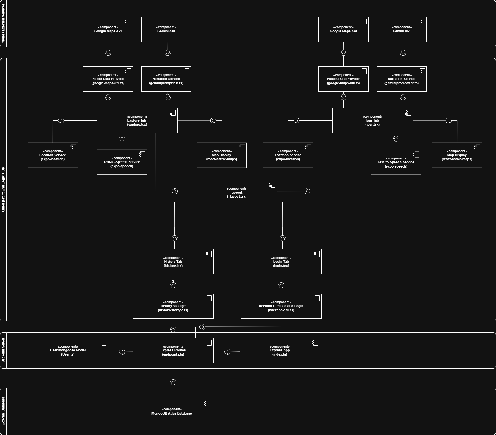

# Amblr (CS35L Project)

Amblr is a Gemini powered mobile app that connects the large language model with the Google Maps API and an intuitive UI to allow users to be guided on tours. The app includes four main tabs:

## Tour
This tab covers the main purpose of the app. It includes links to Google Maps and Gemini to allow for:
* Searching for a destination (could be any valid location Google Maps recognizes)
* Generating a route from the user's current location to their selected destination
* Using the generated route to prompt Gemini and return descriptions of interesting locations along the route

It includes a dynamic system of screens that power the workflow of going on a tour as well as exiting it and choosing different tours.

## Explore
This tab is somewhat similar to the Tour tab (since it includes a map), but instead of setting up tours, it just uses the user's current location to prompt Gemini and return information about nearby places. 

This is done by specifying a range and a prompting interval in seconds (both parameters able to be changed by the user). The Google Maps API returns locations found within the range in relation to the user location.

Text returned by Gemini is also read using text-to-speech (this is also done in the Tour tab).

## History
This tab scrapes information from a user's previous tours (assuming they're logged in). It displays an intuitive interface where the user can view those previous tours and find relevant information about them.

## Login
This tab handles user authentication. It is a typical login screen that provides navigation to a similar signup screen for users to set up an account if they don't have one already.

A user needs to login on this screen in order for the History tab to work properly. If the user is not logged in, History will show a different screen directing the user to the this tab.

## Diagrams
# Explore Tab Sequence Diagram


# Run-Time Component Diagram for Full System


# Setup
You will need a `.env` file in both your root directory and the server directory (for any of the Google Maps and Gemini prompting systems to work). Enter the following keys in the files:
```
GEMINI_KEY=YOUR_GEMINI_KEY
GOOGLE_MAPS_API_KEY=YOUR_GOOGLE_MAPS_KEY
ATLAS_URI=YOUR_MONGODB_URI
PORT=3000
```
> [!NOTE]
When running on an android device, it isn't able to read the Gemini key so replace the reading from env file with the hardcoded gemini key.

> [!NOTE]
To TAs - we will send you all of this information.

Run the following commands:
```
$ npm install
$ cd server
$ npm install
```

> [!NOTE]
> Due to eduroam and UCLA wifi, there are connection issues between the computer server and the client.

In order to properly connect the two, you will have to be off the UCLA Wi-Fi - during our testing, we had to do this by connecting to a hotspot.
In backendcalls.ts inside of the scripts folder, you will have to edit the following line:
```
let SERVER_URL = "http://{your_ip_address}:3000";
```
This should be the ip address of the computer running the server. You can make get your ip address with the following on windows:
```
$ ipconfig
```
Make sure that it is on the same wifi network(or hotspot) as the actual phone when you run this.


# Development
To set up the development system for Expo Go (connects from a phone) run the following command in the root director.
```
$ npx expo start --tunnel
```

Then, open a new terminal and navigate to the server directory. Run the following command:
```
$ npm run dev
```

This should fully set up the app, allowing it to run properly if everything is set up correctly.

To run tests please switch to testing-branch and run:
```
$ npx run jest
```

Presentation Link (featuring a video demo): https://docs.google.com/presentation/d/1l7gn0csWJ4jAGzpuT3A7S7yaNt5S-Y4JP0AOrlOCV8Y/edit?usp=sharing


